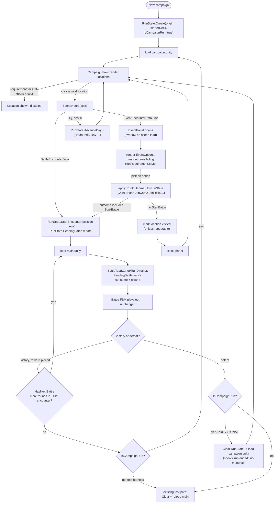

# Campaign Layer — Build Checklist

*As of 2026-07-25. Execution tracker for Phase 2 of `roadmap.md` (M1–M2 of
`metagame-campaign.md`, which is the canonical design — read it first for the "why").
Scope for this pass: **M1 (skeleton) lands and gets playtested before M2 (events) starts** —
phased rollout, one validated commit per step per project convention.*

*Hardened 2026-07-25 against the actual integration points (`RunState`,
`BattleTestStarter`, `PostBattleFlow`, `SceneLoader`), not just the architecture sketch —
see "Hardening decisions" for the gaps that surfaced and the calls made to close them.*

---

## Flow (M1 + M2 combined, so the shape is visible end to end)

Everything under "Battle FSM plays out" is the existing, untouched combat system —
the campaign layer only ever hands it a `BattleSetup` and gets a `BattleEndedEvent` back.

---

## Hardening decisions (edge cases the sketch didn't cover)

These aren't in `metagame-campaign.md` because that doc is architecture-shaped, not
flow-shaped. Surfaced by tracing the actual handoff code:

1. **Campaign runs and test-harness runs look identical to `RunState` today** — both are
   "a `RunState.Current` with a non-empty deck," which is exactly what
   `BattleTestStarter.EnsureRunState` checks to decide "continue vs. rebuild." Without a
   marker, `PostBattleFlow` can't tell "load campaign.unity" from "do the old test
   fallback." **Fix:** `RunState.Create` gets an `isCampaignRun` param (default `false`,
   so every existing `BattleTestStarter` call site is unaffected) → exposed as
   `RunState.Current.IsCampaignRun`.

2. **`PendingBattle` needs a real consumption point, not just a field.** `BattleSetup`
   today is built from `RunState.Current.CurrentBattleEnemies` (from `BattleQueue`, set
   once at `RunState.Create`) plus the inspector-assigned `battleSession` for round
   metadata (turn limit, starting opinion). A campaign encounter needs to *replace* that
   queue with the chosen `BattleEncounterData`'s session, once, without touching the
   existing single-round-session test path. **Fix:** new `RunState.StartEncounter(queue)`
   mutator (sets `BattleQueue` + resets `CurrentBattleIndex` to 0) called when
   `PendingBattle` is set; `BattleTestStarter`/its `RunDirector` promotion checks
   `PendingBattle` first thing, uses its session in place of the inspector field, then
   **clears it immediately** so a second scene load (e.g. pressing Play again in-editor)
   can't silently replay a stale encounter.

3. **`PostBattleFlow`'s branch needs a third leg, not a swap.** The existing
   `HasNextBattle` check already handles multi-round encounters correctly (a
   `BattleEncounterData` can wrap a multi-round `BattleSession` — a boss gauntlet is just
   an encounter with >1 round). That logic doesn't change. What changes is *only* what
   happens once the encounter is truly done: campaign run → `campaign.unity`; no campaign
   → today's `Clear + reload` fallback, byte-for-byte unchanged.

4. **Defeat mid-campaign is a real gap, flagged not silently decided.** Today, any
   defeat unconditionally clears `RunState` and reloads `main.unity` — which would drop a
   campaign loss straight into a fresh **test** battle (wrong origin context, no menu).
   **v1 default (provisional):** defeat during a campaign run clears `RunState` and loads
   `campaign.unity` instead, which will show *some* "run ended" state — but there's no
   title/menu screen yet, so this is a placeholder, not a real game-over flow. Don't
   polish it; revisit once a main menu exists.

5. **`MapLocation` needs a stable identity for "have I done this."** It's a
   `[Serializable]` struct-ish entry embedded in a list on `CampaignMapData`, not its own
   asset — reference/index equality isn't safe to persist against once the list is
   reordered or the asset re-saved. **Fix:** give `MapLocation` a hand-authored (or
   auto-generated-on-create) string `Id`; `RunState` tracks `HashSet<string>
   VisitedLocationIds`. Repeatable locations skip the visited check entirely.

6. **One gating path, not two.** Both map-location visibility (`RunRequirement` on
   `MapLocation`) and event-option graying (`RunRequirement` on `EventOption`) must call
   the *same* `RunRequirement.IsMet(RunState state)` — resist the temptation to special-
   case either caller. This is why `RunRequirement` is listed as an M1 stub-bool-only
   placeholder and a real M2 base class: the shape needs to exist by M1 so the two call
   sites don't diverge later.

7. **Hours-insufficient locations are disabled, not hidden.** A location that costs more
   than remaining Hours stays visible but non-interactive ("costs 3, you have 1") rather
   than disappearing — StS-style affordance, avoids the "wait, where did that go" feeling.
   HQ is always enabled at 0 cost so the day can always be ended even at 0 Hours.

8. **`CampaignFlow` must re-render on every return to the map** — after a battle, after
   an event resolves, after HQ — because Funds/Relics/VisitedLocationIds may have
   changed what's affordable or unlocked. One `RefreshLocations()` entry point, called
   from all three return paths, not three separate rebuild implementations.

9. **HQ is a hardcoded button in M1, not yet the `EventEncounterData` the design doc
   describes** ("HQ is just an EventEncounterData at hour cost 0") — because
   `EventEncounterData`/`RunOutcome` don't exist until M2. Flagging explicitly so this
   gets *promoted* to a real 0-cost location in M2 rather than living as a permanent
   special case alongside the generic system.

---

## M1 — Campaign skeleton

Goal: roam a list of locations, spend Hours, hand off into an existing battle unchanged,
come back. No events yet — `BattleEncounterData` is the only encounter type wired up.

- [x] `RunState`: add `Hours`/`MaxHours`, `Day`, `Funds` (meta currency, placeholder name),
      `IsCampaignRun`, `PendingBattle`, `VisitedLocationIds` + mutators (`SpendHours`,
      `GainFunds`, `AdvanceDay`, `StartEncounter(queue)`, `MarkVisited(id)`). `Create` gets
      an `isCampaignRun = false` param — every existing call site unaffected. *(2026-07-25,
      compile-checked via dotnet msbuild against Crookedile.Runtime.)*
- [x] `EncounterData` abstract SO (display name, blurb, hour cost) + `BattleEncounterData`
      subclass wrapping a `BattleSession` reference (+ boss flag, reward tier — boss flag
      unused until M3, add now since it's free on the type). *(2026-07-25,
      `Assets/Scripts/Data/Campaign/`. **Needs Unity to generate .meta files before
      committing** — new scripts, not yet opened in the editor.)*
- [ ] `CampaignMapData` (SO: location list) + `MapLocation` (`[Serializable]`: stable
      string `Id`, an `EncounterData`, unlock-requirements placeholder, repeatable flag).
      Requirements can be a stub bool for now — `RunRequirement` doesn't exist until M2,
      but the field/call-site shape should already anticipate `IsMet(RunState)`.
- [ ] `campaign.unity` scene + `CampaignFlow` (Mono): plain button-per-location list (no
      drawn map). `RefreshLocations()` — the single rebuild entry point — disables (not
      hides) locations costing more Hours than remain; HQ button always enabled, calls
      `AdvanceDay()`. Self-creates a debug `RunState` if none exists (mirrors
      `BattleTestStarter`; dev-only path, not the defeat/game-over landing).
- [x] Battle handoff, **receiving half done**: `BattleTestStarter.StartTestBattle` now
      reads `RunState.Current.PendingBattle?.Session` as the effective session (falls back
      to the inspector field, untouched test path) and clears `PendingBattle` immediately
      after reading it. *(2026-07-25.)* **Sending half still open** — nothing calls
      `StartEncounter`/`SetPendingBattle` yet; that's `CampaignFlow`, which doesn't exist
      until the scene/location list below is built.
- [x] `PostBattleFlow`: `HasNextBattle` branch unchanged (multi-round encounters). New
      shared `ReturnToCampaignOrRestart()` — encounter-complete and defeat both route
      through it: `IsCampaignRun` → load `campaign`; else → today's `Clear + reload`
      fallback, byte-for-byte unchanged. *(2026-07-25, compile-checked via dotnet msbuild
      against Crookedile.UI.)*
- [ ] Playtest: pick a location from the map → fight → win → land back on the map with
      Hours spent, the location correctly marked visited, and `RefreshLocations()`
      reflecting the new state. Also test: lose a battle mid-campaign and confirm it
      doesn't silently drop into a test battle. **Gate before M2.**

## M2 — Events

Goal: non-battle locations with choices that mutate the run (currency, cards, relics).
Only start once M1 is confirmed working in play.

- [ ] `RunRequirement` abstract `[SerializeReference]` base (`IsMet(RunState state)`) +
      first concretes: `HasRelic`, `HasCardOfType`, `FundsAtLeast`. Wire this into the M1
      `MapLocation` stub-bool call site too, so there's exactly one gating path (hardening
      note 6).
- [x] `RunOutcome` abstract `[SerializeReference]` base (`Apply(RunState state)`) + first
      concretes: `AdjustFundsOutcome`, `AdjustCredibilityOutcome`, `GrantRelicOutcome`.
      Mirrors the `BattleEffect` pattern (Odin type-picker + `[InfoBox]` live description +
      `EditorSafeDescription`). *(2026-07-28, `Assets/Scripts/Data/Campaign/RunOutcome.cs`.
      **Needs Unity to generate .meta files before committing.**)*
      - Outcomes are **signed** (`AdjustFunds(-20)`), so a choice can cost something. This
        replaced `RunState.GainFunds` (gain-only, zero callers) with `AdjustFunds`/
        `AdjustCredibility`, both clamped at zero.
      - `Credibility` added to `RunState` — meta axis only, battle never reads it.
      - **Deferred deliberately:** `GainCard`, `StartBattle`, `Nothing`. Scoped to the three
        outcomes that carry the first events; each is ~10 lines to add against the same base.
- [x] `EventOption` (`[Serializable]`: label + `RunOutcome[]` + a `ResultText` shown after
      the pick, so a choice reads as consequence rather than a silent stat change).
      **No `RunRequirement[]` yet** — gating deferred with the requirement system below.
      *(2026-07-28, `Assets/Scripts/Data/Campaign/EventEncounterData.cs`.)*
- [x] `EventEncounterData` (body text + `EventOption[]`). *(2026-07-28.)* Dispatch case in
      `CampaignFlow` still open — `CampaignFlow` doesn't exist until M1's scene lands.
- [ ] `EventPanel` — self-subscribing prefab island over the map (panel toggle, no scene
      load, matches the BattleUI-decomposition pattern): renders body text + option
      buttons, greys out options whose requirements fail, applies the chosen option's
      outcomes on click, marks the location visited (unless repeatable), closes back to
      the map and triggers `RefreshLocations()`. If the chosen option's outcomes include
      `StartBattle`, skip the "mark visited + close" step and fall straight into the
      battle handoff instead.
- [ ] Promote HQ from the M1 hardcoded button to a real `EventEncounterData` at 0 hour
      cost with one option ("Rest") whose outcome is a new `AdvanceDay`/`EndDay`
      `RunOutcome` (hardening note 9).
- [ ] Content Hub: add an Events provider (`IContentProvider`) so authored events get the
      same audit-and-click-to-select treatment as cards/enemies/relics.
- [ ] Author 2–3 test events (one grants Funds, one grants a card, one gated by
      `HasRelic`/`FundsAtLeast` to prove requirement gating) — proves the pipeline before
      scaling to the roadmap's 3–5.
- [ ] Playtest: roam, hit an event, pick an option, confirm the outcome actually lands in
      `RunState` (currency total updates, card shows up in next battle's deck, gated
      option correctly disabled before you meet its requirement and enabled after).

## Deferred (not this pass — M3+/roadmap-later)

- Boss flag payoff + pick-1-of-3 relic reward (M3).
- `RewardConfig`-driven "win well" reward scaling (M3).
- Shops (`ShopEncounterData`) — blocked on currency existing, itself blocked on M2 landing.
- A real game-over/menu flow for campaign defeat (M1 ships a provisional stand-in — see
  hardening note 4).
- Campaign end condition (⚑ `metagame-campaign.md` §5).
- **Encounter pool / randomised selection** (raised 2026-07-28). **Data + tooling landed
  early; runtime wiring deferred.**
  - [x] `EncounterPoolData` + `EncounterPoolEntry` — per-entry day window (`FirstDay`/
        `LastDay`, 0 = open-ended), `OncePerRun`, and a two-level drop chance.
        `DrawForDay(day, count, seed, exclude)` is deterministic from `(seed, day)` and uses
        its own `System.Random` so campaign seeding never perturbs battle RNG.
  - [x] **Drop chance with a default:** `EncounterData.DropWeight` is the encounter's own
        chance; a pool entry's `_weight` overrides it, and `-1` (the default) means inherit.
        `ResolvedWeight` is the single resolution point — every draw, eligibility check, and
        the Gantt view read it, so the fallback can't diverge between them.
  - [x] `EncounterData.ID` — auto-generated GUID, same `OnValidate`/`Reset` idiom as
        `EnemyData`. Closes hardening note 5's "stable identity" gap for encounters, and
        `VisitedLocationIds` now keys off it rather than an asset name.
  - [x] `EncounterDatabase : GameDatabase<EncounterData>` — one database across all
        subtypes (`t:EncounterData` matches derived assets), plus `GetOfType<T>()` and
        `GetUndrawable()` (weight ≤ 0, i.e. authored but can never be drawn).
  - [x] `RunState.Seed` — `Create(seed: 0)` (the default, and every existing call site)
        picks a random one; any other value replays that exact campaign.
  - [x] `Crookedile → Encounter Gantt` editor window — day timeline per entry, a coverage
        strip that flags days with nothing eligible, and a seed roller that runs the real
        `DrawForDay` across all days with once-per-run exclusions carried forward.
  - [ ] **Wiring:** nothing calls `DrawForDay` yet. `CampaignFlow` populates the day's
        locations from the pool instead of a hand-authored list — blocked on `CampaignFlow`
        existing (M1). Until then the pool is authorable and inspectable but inert.
  - Deliberately still hand-authored-compatible: `CampaignMapData`'s fixed location list and
    the pool can coexist, so the switch to random days is a per-map choice, not a migration.
